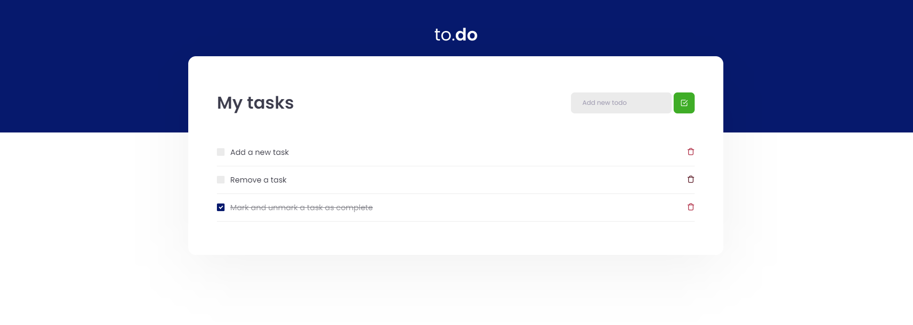

  

	
  
  
  
   
  
  

# 📖 About Project

This application is the first challenge from the [Ignite Bootcamp](https://rocketseat.com.br/ignite).

This will be an application where your main objective is a small to-do application, to train a little more about state manipulation in React.

- Add a new task
- Remove a task
- Mark and unmark a task as complete

# 📷 Layout

  

    
  

### 🚀 Tecnologies

- React.js
- Typescript
- SCSS

# 🔧 How to run

- Download this project to your computer or use the git command `git clone https://github.com/luanaferraz/to-do-list.git`
- Open the folder to-do-list in your system's shell
- Run `yarn install` to install the project's modules
- Run `yarn dev`

# :closed_book: License

This project is under the [MIT license](./LICENSE).

Give a ⭐️ if this project helped you!

#

   <b> Feito com 💖 por <a href="https://www.linkedin.com/in/luanaferraz/">Luana Ferraz</a></b>

